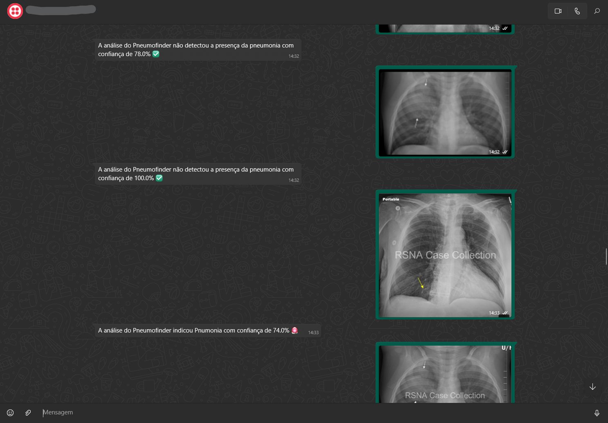

# 🫁 PneumoFinder APIrestful

          

---

O **PneumoFinder** é uma API RESTful desenvolvida em **Flask** que utiliza **Redes Neurais Convolucionais (CNNs)** para análise de radiografias de pulmão.  
A aplicação é capaz de:

- Verificar se a imagem enviada é de um pulmão.  
- Detectar sinais de **pneumonia** em radiografias.  
- Fornecer diagnósticos completos com nível de confiança.  
- Integrar-se ao **WhatsApp** via Twilio, permitindo que o usuário envie a radiografia e receba o diagnóstico diretamente no aplicativo de mensagens.  

---

## 📌 Funcionalidades

- **`/verificar_pulmao`** → Verifica se a imagem enviada é de um pulmão.  
- **`/diagnosticar_pneumonia`** → Detecta pneumonia em uma radiografia de pulmão.  
- **`/diagnostico_completo`** → Faz a verificação completa: primeiro identifica se é pulmão e, se confirmado, analisa a presença de pneumonia.  
- **`/webhook`** → Endpoint conectado ao **Twilio** para receber mensagens no WhatsApp com imagens de radiografias e retornar automaticamente o diagnóstico.  

---

## 🛠️ Tecnologias Utilizadas

- **Python 3.x**  
- **Flask**  
- **Flask-CORS**  
- **TensorFlow / Keras**  
- **Twilio API**  
- **dotenv**  
- **requests**  

---

## 📂 Estrutura do Projeto

```
PneumoFinder/
│── models/                  # Modelos treinados (.keras)
│   ├── pneumonia_model.keras
│   └── pulmao_model.keras
│
│── service/
│   ├── pneumonia_service.py # Classe DetectorDePneumonia
│   └── pulmao_service.py    # Classe DetectorDePulmao
│
│── imgs_pulmoes/            # Pasta para armazenar imagens recebidas via WhatsApp
│
│── temp/                    # Pasta temporária para upload de imagens
│
│── app.py                   # API principal (diagnósticos REST)
│── webhook.py               # Integração com WhatsApp via Twilio (renomear chat_bot_service.py)
│── requirements.txt         # Dependências do projeto
│── .gitignore               # Ignorar venv, temp, etc.
│── notes.txt                # Anotações auxiliares (se quiser manter)
│── testar_modelo.py         # Script para testar localmente os modelos

```

---

## ⚙️ Instalação e Configuração

1. Clone este repositório:
   ```bash
   git clone https://github.com/seu-usuario/pneumofinder.git
   cd pneumofinder
   ```

2. Crie um ambiente virtual e instale as dependências:
   ```bash
   python -m venv venv
   source venv/bin/activate   # Linux/Mac
   venv\Scripts\activate    # Windows
   pip install -r requirements.txt
   ```

3. Configure as variáveis de ambiente no arquivo `.env`:
   ```env
   TWILIO_ACCOUNT_SID=seu_sid
   TWILIO_AUTH_TOKEN=seu_token
   ```

4. Execute a API:
   ```bash
   python app.py
   ```

5. Para rodar o webhook do WhatsApp:
   ```bash
   python chat_bot_service.py
   ```

---

## ✅ Exemplo de Uso (cURL)

```bash
curl -X POST http://localhost:5001/diagnostico_completo   -F "imagem=@radiografia_teste.jpg"
```

Resposta esperada:
```json
{
  "classe_pulmao": "PULMÃO",
  "confianca_pulmao": 0.98,
  "classe_pneumonia": "NORMAL",
  "confianca_pneumonia": 0.92
}
```
---

## 📲 Imagens no WhatsApp (Chatbot)

📸 **Exemplo de envio de radiografia e resposta do bot:**  

  


---

## 📌 Observações

- O modelo espera imagens no formato e tamanho específico (224x224).
- As imagens são normalizadas antes de serem enviadas ao modelo.
- O projeto está em ambiente local para testes. Para produção, considere segurança, performance e escalabilidade.

---

## 🧠 Sobre o modelo de IA

O modelo é uma CNN treinada com base em imagens reais de pulmões com e sem pneumonia. Ele foi salvo no formato `.keras` e carregado diretamente pelo backend.
A predição é feita utilizando limiar de 0.5 para classificar como NORMAL ou PNEUMONIA. Os modelos atualmente apresentam **cerca de 80% de acurácia** nas previsões,
mas o objetivo é continuar aprimorando o treinamento para aumentar este valor e garantir resultados ainda mais confiáveis.

---

## 🤝 Contribuições

Contribuições são bem-vindas! Sinta-se livre para abrir issues ou enviar pull requests com melhorias, correções ou novas funcionalidades.

---

## 📄 Licença

Este projeto está sob a licença MIT. Veja o arquivo [LICENSE](LICENSE) para mais detalhes.

---


## 👨‍💻 Autor

Feito por **[Cauã Farias]**  
[LinkedIn](https://www.linkedin.com/in/cau%C3%A3-farias-739013288/) • [GitHub](https://github.com/CauZy-Goes)
